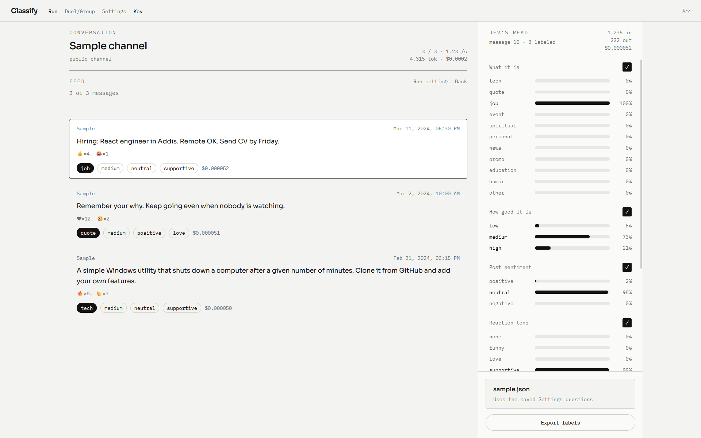

# Classify

A local web app that classifies Telegram Desktop JSON exports with [Jev](https://vercel.com/ai-gateway/models/jev). Drop a channel or chat archive, define questions, and get labeled posts with token/cost meters.

## Use cases

- Tag a public channel by intent (tech, promo, news, and so on), quality, sentiment, and reaction tone
- Read a private chat or group for topic, intention, and emotion, plus a per-speaker tone summary
- Prototype custom classifiers (choice, score, or boolean) without writing a new pipeline

## How to use

1. In Telegram Desktop: **Settings → Advanced → Export Telegram data**. Export JSON for a channel, group, or private chat.
2. Install and run:

```sh
pnpm install
cp .env.example .env
pnpm run dev
```

3. Add a key in **Key** (browser) or in `.env`:
   - [Vercel AI Gateway](https://vercel.com/ai-gateway): `AI_GATEWAY_API_KEY`
   - [TypeSafe](https://console.typesafe.ai/settings/keys): `JEV_API_KEY`
4. Open **Run** for a channel, or **Duel/Group** for a chat. Drop `result.json`, set date/limit filters, then classify.
5. Edit questions, model, concurrency, and retries on **Settings**.

`pnpm run build` / `pnpm run preview` produce and serve a production build.

## Tech stack

Svelte 5, SvelteKit, TypeScript, Tailwind CSS v4, Vite, Vercel AI SDK (`ai`, `@ai-sdk/gateway`, `@ai-sdk/typesafe-ai`).

## Links

- [Jev on Vercel AI Gateway](https://vercel.com/ai-gateway/models/jev)
- [TypeSafe quickstart](https://docs.typesafe.ai/introduction/quickstart)
- [TypeSafe API keys](https://console.typesafe.ai/settings/keys)
- [SvelteKit](https://svelte.dev/docs/kit)
- [Vercel AI SDK](https://ai-sdk.dev)
- [Telegram Desktop](https://desktop.telegram.org)
